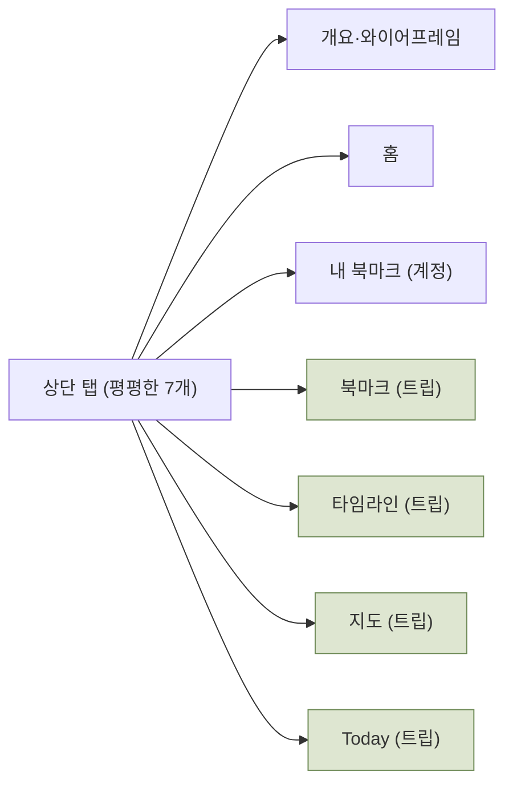
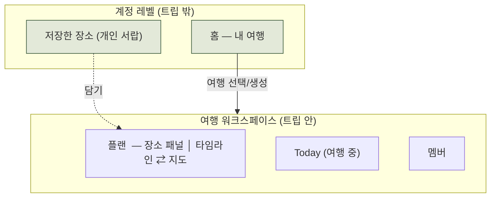

# UX 재설계 설계안 — Travel Maker

| 항목 | 내용 |
|---|---|
| 목적 | 컬러·타이포가 아니라 **화면 구조·흐름(UX)** 자체를 재설계 |
| 대상 | `docs/prototype.html` (현 v0.4), PRD v0.4 |
| 타깃 문제 | ① 북마크 개념 2개 혼란 ② 네비게이션·와이어프레임 주석 구조 ③ (동반) 계획 화면 3분할 |
| 상태 | **제안 — 합의 후 prototype.html 재구성** |

> 이 문서는 "무엇을 왜 바꾸는가"를 합의하기 위한 설계안입니다. 합의된 항목만 프로토타입에 반영합니다.

---

## 0. 한눈에 — 무엇이 바뀌나

| # | 지금 (v0.4) | 제안 |
|---|---|---|
| A | 상단에 7개 탭이 평평하게 나열 (`개요·홈·내 북마크·북마크·타임라인·지도·Today`) | **2단 네비**: 계정 레벨(홈·저장한 장소) ↔ 여행 안으로 들어가면 트립 레벨(플랜·Today·멤버) |
| B | "내 북마크"(계정) + "북마크"(트립) — 같은 이름 2개 | 이름·역할 분리: **저장한 장소**(계정 서랍) → 여행에 **담기** → 트립 안에서는 **장소/후보** |
| C | 북마크·타임라인·지도가 각각 별도 탭 → 계속 왕복, 드래그 단절 | **플랜** 한 화면: `장소 패널 │ 타임라인 ⇄ 지도`. 패널에서 슬롯으로 바로 드래그 |
| D | ①②③ 주석 칩 + "와이어프레임 노트"가 화면을 덮음 | 제품 화면은 **깨끗하게**. 주석은 기본 off, "주석 보기" 토글로만 |
| E | 홈·트립 화면이 섞여 "지금 어느 여행인지" 맥락 없음 | 트립 진입 시 워크스페이스 셸(여행명·기간·멤버)이 항상 상단에 |

---

## 1. 정보 구조(IA) — Before / After

### Before (현재)

문제: 계정 화면(홈·내 북마크)과 **특정 트립 안에서만 의미 있는 화면**(북마크·타임라인·지도·Today)이 한 줄에 섞여 있음.

### After (제안)

- **트립 밖**: 홈, 저장한 장소 (둘 다 계정 소유)
- **트립 안**: 플랜 / Today / 멤버 — 워크스페이스 셸 안에서만 접근

---

## 2. 문제 B — "북마크 2개" 해소

### 개념은 그대로, 이름·위치·연결만 바꾼다
PRD의 데이터 모델은 옳습니다(계정 `bookmarks` → 트립 `spots` 복사본). 혼란은 **둘 다 "북마크"로 부르고, 둘 다 상단 탭에 나란히** 둔 데서 옵니다.

| 레이어 | 지금 이름 | 제안 이름 | 성격 |
|---|---|---|---|
| 계정 라이브러리 (`bookmarks`) | 내 북마크 | **저장한 장소** *(대안: 내 컬렉션)* | 개인 서랍. 여러 여행에 재사용. 나만 봄 |
| 트립 작업본 (`spots`) | 북마크 | **장소** (상태: 후보/배치/방문) | 이 여행의 작업 목록. 멤버 공유 |

→ "북마크"라는 단어는 **계정 서랍 하나에만** 남고, 트립 안에서는 "장소/후보"로 부릅니다. 같은 이름 충돌 제거.

### 연결(담기) 흐름 — 서랍에서 꺼내 쓰는 메타포
"저장한 장소"를 **별도로 방문하는 탭**이 아니라, 플랜 화면 안에서 **꺼내오는 소스**로 만듭니다.

```
[플랜] 장소 패널 → "+ 장소 추가" ┬─ Google Places 검색
                                 ├─ 저장한 장소에서 담기  ← 계정 서랍
                                 └─ 직접 입력
```
- 계정 서랍(저장한 장소)은 트립 밖에서 **모으는 용도**(스샷 OCR·지도 링크·직접입력)로 존재 — 지금 기능 유지.
- 트립 안에서는 그 서랍을 **패널에서 바로 꺼내** 후보로 담음 → "두 번째 북마크 화면"이 사라짐.

---

## 3. 문제 A·E — 네비게이션 2단 구조

### 계정 레벨 상단바 (트립 밖)
```
┌──────────────────────────────────────────────┐
│ Travel Maker        홈   저장한 장소      [S] │
└──────────────────────────────────────────────┘
```
트립 화면(타임라인·지도·Today)은 여기서 **사라집니다**. 여행을 골라야 들어갑니다.

### 트립 워크스페이스 셸 (트립 안)
```
┌ ← 홈   이탈리아 여행  5/11–5/23   [S][하] +초대 ┐
│  ● 플랜      ○ Today      ○ 멤버                │  ← 트립 서브탭
└────────────────────────────────────────────────┘
```
항상 상단에 여행명·기간·멤버가 보여 "지금 이 여행 안"이라는 맥락이 유지됩니다. `← 홈`으로 계정 레벨 복귀.

---

## 4. 문제 C — 통합 "플랜" 화면 (핵심)

북마크·타임라인·지도 **3탭 → 플랜 1화면**. PRD가 풀려던 "지도와 일정 분리"를 프로토타입이 되살려놓은 걸 실제로 해소합니다.

### 데스크톱
```
┌ 이탈리아 여행 · 플랜 ────────────────────────────────────────┐
│ ● 플랜   ○ Today   ○ 멤버                                     │
├───────────────┬──────────────────────────────────────────────┤
│ 장소            │   뷰:  [ 타임라인 ]  [ 지도 ]                 │
│ 🔍 검색·추가    │                                              │
│ ─ 피렌체 (12)   │    5/13   5/14   5/15   5/16 ...              │
│  ▸ 두오모       │  09 ┌──────┐                                 │
│  ▸ 우피치 ★     │  10 │ 투어 │   ← 좌측 패널에서 드래그해 배치 │
│  ▸ 베키오 다리  │  11 └──────┘                                 │
│ ─ 토스카나 (8)  │  12                                          │
│  ▸ …            │  …                                           │
│                 │                                              │
│ [상태: 후보만]  │                                              │
│ [+ 장소 추가]   │                                              │
└───────────────┴──────────────────────────────────────────────┘
```
- **왼쪽 장소 패널**(도시 그룹 + 상태 필터 + 검색/추가)과 **오른쪽 캔버스**가 항상 같이 보임 → 드래그가 화면을 넘지 않음(문제 D의 드래그 단절 해결).
- 캔버스는 **타임라인 ⇄ 지도 토글**. 지도로 바꿔도 왼쪽 패널은 그대로 → 동선 보며 후보를 바로 배치.
- 배치된 장소는 패널에서 "배치됨" 상태로 표시(현 status 라이프사이클 재사용).

### 모바일
플랜 안에서 세그먼트 전환: `[장소] [타임라인] [지도]` — **트립 안 한 맥락**에서의 뷰 전환이지, 최상위 탭이 아님. Today는 별도 유지(여행 중 전용 모드).

---

## 5. 문제 D — 와이어프레임 티 벗기

- ①②③ 주석 칩, "와이어프레임 노트" 박스, `개요·와이어프레임` 탭 → **제품 화면에서 제거**.
- 설명(근거)은 이 문서와 PRD로 이동. 잃지 않되 제품 위에 얹지 않음.
- 필요하면 상단에 **"주석 보기" 토글** 하나만 두어, 켤 때만 오버레이로 노트 표시(기본 off).
- 결과: 프로토타입이 **설계 문서가 아니라 실제 앱**처럼 읽힘.

---

## 6. 화면 인벤토리 Before → After

| 현재 화면 | 제안 |
|---|---|
| 개요·와이어프레임 | 삭제 (근거는 문서로) |
| 홈 | 유지 — 계정 레벨. "여행 중" 배지·Today CTA 유지 |
| 내 북마크 | **저장한 장소**로 개명 — 계정 레벨 서랍(모으기 전용). 3종 입력·검색·중복감지 유지 |
| 북마크(트립) | 삭제 → **플랜의 장소 패널**로 흡수 |
| 타임라인 | **플랜의 캔버스(타임라인 뷰)**로 흡수 |
| 지도 | **플랜의 캔버스(지도 뷰)**로 흡수 |
| Today | 유지 — 트립 레벨 별도 모드 |

---

## 7. 구현 영향 (재구성 시)

- 기존 JS 로직은 **대부분 재사용** 가능: 타임라인 드래그/팝오버, 지도 필터·마커·동선, 상태·그룹 필터, 위저드, Today 삽입 로직.
- 바뀌는 부분: (1) 3개 트립 화면을 **하나의 플랜 화면**에 재배치, (2) 드래그 소스를 좌측 장소 패널로 연결, (3) 타임라인/지도 **뷰 토글** 추가, (4) 상단 네비 2단 분리, (5) 주석 오버레이 토글화.
- PRD 정합성: F3(북마크)·F4(타임라인)·F5(지도)의 **기능 요구사항은 그대로**, 배치·명칭만 조정. PRD도 함께 소폭 개정 필요(용어: 북마크/장소).

---

## 8. 확인이 필요한 결정

1. **계정 서랍 이름**: `저장한 장소` vs `내 컬렉션` vs 기타?
2. **트립 작업본 이름**: `장소`(상태=후보/배치/방문)로 통일 OK?
3. **플랜 캔버스**: 타임라인 ⇄ 지도 **토글**(한 번에 하나) vs 넓은 화면에서 **동시 표시**?
4. **개요·와이어프레임 탭**: 완전 삭제 OK? (아니면 "주석 보기" 토글로 축소)
5. **PRD 동시 개정**: 용어(북마크→장소) 반영해 PRD도 같이 업데이트할까요?
